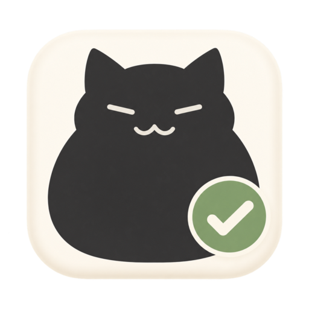
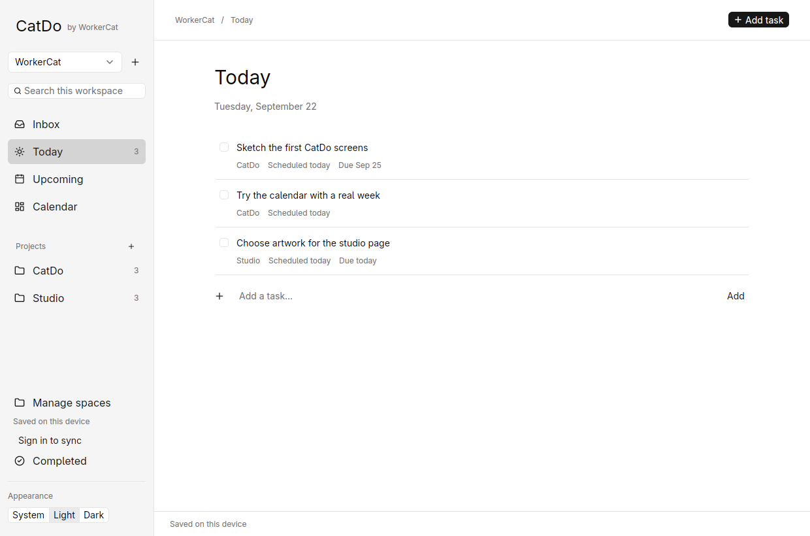
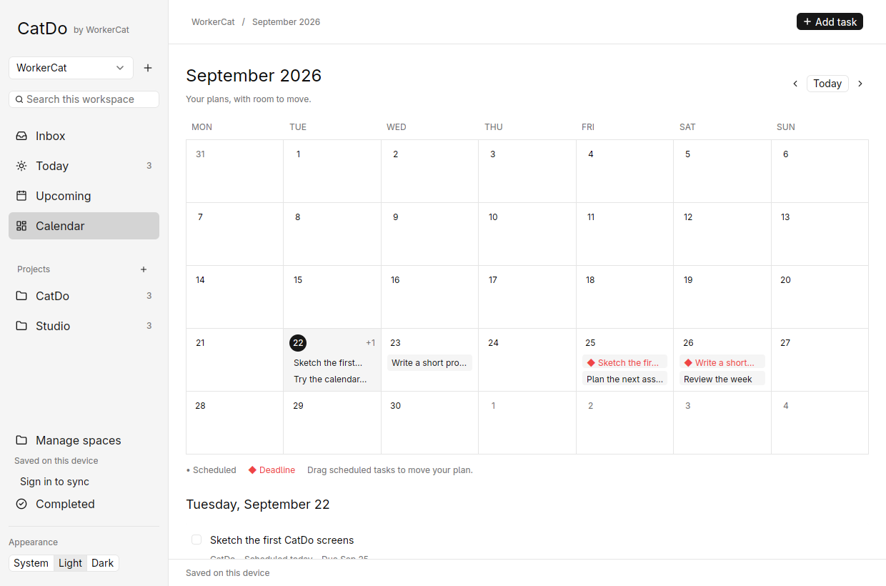
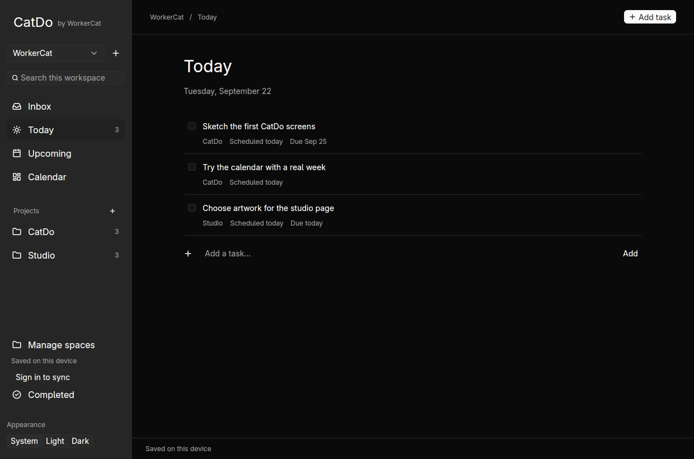

<p align="center">
  
</p>

<h1 align="center">CatDo</h1>

<p align="center">
  <strong>A little more organized. A little more room to breathe.</strong><br>
  A calm task manager for your work, your projects, and the rest of your life.
</p>

<p align="center">
  <a href="https://catdo.workercat.com/app">Open CatDo</a> ·
  <a href="https://catdo.workercat.com">Website</a> ·
  <a href="https://github.com/workercatstudios/catdo/releases">Download for Linux</a> ·
  <a href="docs/development.md">Developer guide</a>
</p>

<p align="center">
  <a href="#run-it-on-fedora">
    <picture>
      <source media="(prefers-color-scheme: dark)" srcset="https://shieldcn.dev/badge/Linux-Fedora-blue.svg?variant=outline&amp;size=sm&amp;logo=linux&amp;mode=dark">
      
    </picture>
  </a>
  <a href="apps/desktop">
    <picture>
      <source media="(prefers-color-scheme: dark)" srcset="https://shieldcn.dev/badge/Desktop-GPUI_Kit-grey.svg?variant=outline&amp;size=sm&amp;logo=rust&amp;mode=dark">
      
    </picture>
  </a>
  <a href="workers/api">
    <picture>
      <source media="(prefers-color-scheme: dark)" srcset="https://shieldcn.dev/badge/Sync-Cloudflare-orange.svg?variant=outline&amp;size=sm&amp;logo=cloudflare&amp;mode=dark">
      
    </picture>
  </a>
  <a href="LICENSE.md">
    <picture>
      <source media="(prefers-color-scheme: dark)" srcset="https://shieldcn.dev/badge/License-PolyForm_Noncommercial-grey.svg?variant=outline&amp;size=sm&amp;logo=false&amp;mode=dark">
      
    </picture>
  </a>
</p>

<picture>
  <source media="(prefers-color-scheme: dark)" srcset="docs/screenshots/today.png">
  <source media="(prefers-color-scheme: light)" srcset="docs/screenshots/today-light.png">
  
</picture>

## Somewhere to put it all

A small task. A project with a dozen moving parts. That thing you keep meaning to do.

CatDo gives each of them a place. Capture it in your inbox, put it in a project, and pick a day to work on it. Keep personal tasks and work in separate workspaces. Build a routine as you go.

Inspired by Todoist, built for individuals, and starting with the machine we use every day: Fedora.

| Make room for…                    | What CatDo does                                                                                                     |
| --------------------------------- | ------------------------------------------------------------------------------------------------------------------- |
| **Your different hats**           | Separate workspaces for personal life and work, with projects, search, and views scoped to each one.                |
| **A manageable today**            | Inbox, Today, Upcoming, and Calendar keep the next step within reach. Notes and subtasks hold the details.          |
| **Plans that change**             | Schedule a task for Tuesday and give it a Friday deadline. Move the plan without moving the deadline.               |
| **Things that come around again** | Repeat daily, weekly, monthly, on selected weekdays, or after completion. Finished occurrences stay in history.     |
| **A little flexibility**          | Work offline, undo task actions, and sync through your WorkerCat account when connected.                            |
| **Your own setup**                | A native Rust desktop built with GPUI Kit. Follow the OS theme or choose Light or Dark, with your preference saved. |

## See the week ahead

The month calendar brings scheduled work and deadlines together, with an agenda for the selected day. Drag a scheduled task to make room; its deadline stays put.



<details>
<summary><strong>Prefer the lights off? See the dark desktop.</strong></summary>



</details>

_Screenshots show the current Linux desktop with sample tasks._

## Where you can use it

| Platform          | Status                                                                                                           |
| ----------------- | ---------------------------------------------------------------------------------------------------------------- |
| **Linux desktop** | Built and tested on Fedora. Local use needs no account; sign in to sync.                                         |
| **Web**           | [Available now](https://catdo.workercat.com/app), with offline editing after the first online visit and sign-in. |
| **Android**       | Planned as a native app.                                                                                         |
| **Windows**       | Planned after Linux.                                                                                             |
| **macOS**         | Not planned.                                                                                                     |

CatDo is in active development, built first for daily personal use. Native Wayland validation, accessibility, and broader release testing are still ahead. Desktop screenshots and visual checks currently use Fedora through XWayland.

## Run it on Fedora

Download the Linux x86-64 AppImage from [GitHub Releases](https://github.com/workercatstudios/catdo/releases), make it executable, and run it:

```sh
chmod +x CatDo.AppImage
./CatDo.AppImage
```

Replace `CatDo.AppImage` with the downloaded filename. A `.tar.gz` with a user-level installer and SHA-256 checksums is also provided. Release builds target glibc 2.39 or newer; graphics drivers and a desktop session are still required. See the [Linux package notes](packaging/README.md) for installation and AppImage troubleshooting.

### Build from source

With Rust and the Linux build dependencies installed, start the desktop from the repository root:

```sh
cargo run --locked -p catdo-desktop
```

Or build an optimized binary:

```sh
cargo build --locked --release -p catdo-desktop
./target/release/catdo
```

To add CatDo to your application launcher:

```sh
bash scripts/install-desktop.sh
```

The installer builds locally and installs for your user. Tasks live in `~/.local/share/catdo/catdo.sqlite3` by default. **Sign in to sync** connects your existing WorkerCat account through Clerk; desktop credentials stay in the system keyring.

Want to explore with sample tasks? Use a new, separate data directory:

```sh
cargo run --locked -p catdo-core --example demo -- /tmp/catdo-demo
cargo run --locked -p catdo-desktop -- --data-dir /tmp/catdo-demo
```

The demo generator refuses to overwrite an existing database. See the [developer guide](docs/development.md#fedora-desktop) for graphics troubleshooting, storage details, and local development.

### Keep your hands on the keyboard

| Shortcut | Action                                               |
| -------- | ---------------------------------------------------- |
| `Ctrl+N` | New task                                             |
| `Ctrl+F` | Search this workspace                                |
| `Ctrl+S` | Save task details                                    |
| `Ctrl+Z` | Undo the last task action                            |
| `Ctrl+1` | Go to Today                                          |
| `Escape` | Save and close details, or dismiss a creation dialog |

Text fields keep their own undo history.

## Built simply, all the way down

| Part                         | Stack                                       | Source                                   |
| ---------------------------- | ------------------------------------------- | ---------------------------------------- |
| Desktop                      | Rust + GPUI Kit                             | [`apps/desktop`](apps/desktop)           |
| Desktop domain and storage   | Rust + SQLite                               | [`crates/catdo-core`](crates/catdo-core) |
| Website and web app          | React + Vite + IndexedDB                    | [`apps/web`](apps/web)                   |
| Web domain and sync contract | TypeScript                                  | [`packages/domain`](packages/domain)     |
| API and account storage      | Cloudflare Workers + SQLite Durable Objects | [`workers/api`](workers/api)             |

Changes are saved locally before syncing. Edits to different records merge automatically; conflicting edits to the same record ask you to choose. CatDo shares WorkerCat sign-in while keeping its own task storage, separated by account.

A few current boundaries: desktop reminders need the app open, recurring tasks show their current occurrence, and sync supports up to 900 KB of serialized task data per account. Signing out keeps local task data on the device. Web Manage includes JSON export.

For setup, checks, and deployment, start with the [developer guide](docs/development.md). The [implementation notes](docs/implementation.md) explain storage, recurrence, sync, and current limits; the [product brief](docs/product-brief.md) covers the direction.

## License

CatDo is **source available** under the [PolyForm Noncommercial License 1.0.0](LICENSE.md). Use, modification, and redistribution are subject to those terms. Commercial use requires a separate license from WorkerCat. Dependencies retain their own licenses; no trademark rights are granted.

---

<p align="center">Made by <a href="https://workercat.com">WorkerCat</a>. One task at a time.</p>
